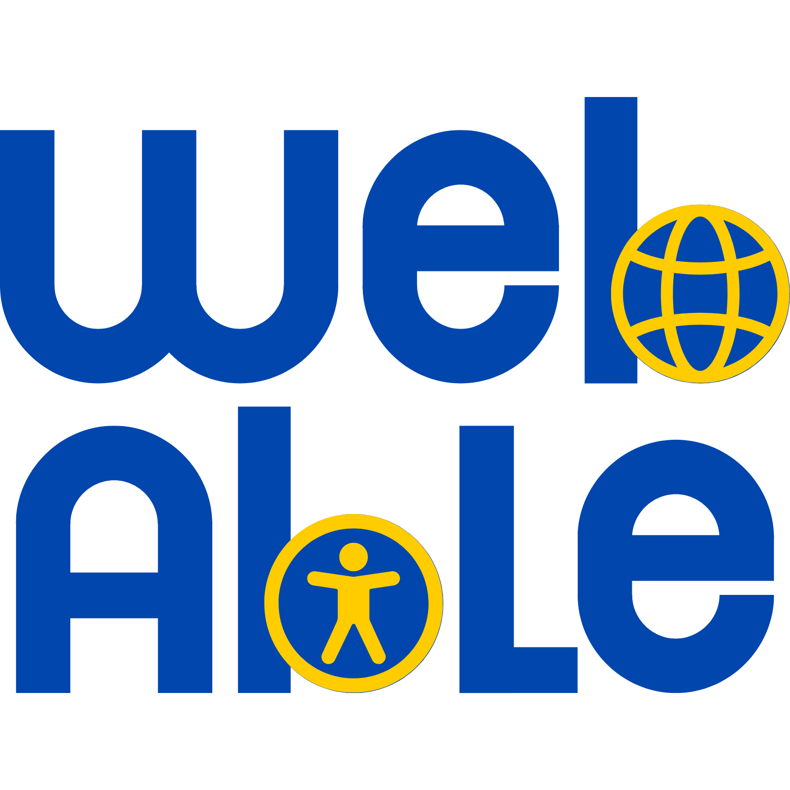

# Pocket Grupo 10

  

## **Descrição**

O Pocket é um projeto desenvolvido no contexto da disciplina de Interação Humano-Computador (IHC), ministrada pela professora Rejane Maria da Costa Figueiredo na Universidade de Brasília (UnB).

Seu principal objetivo é disponibilizar um checklist prático de acessibilidade digital, abrangendo áreas fundamentais de um projeto: Desenvolvimento Web, Design, Geração de Conteúdo e Gestão de Projetos.

O Pocket foi criado a partir da necessidade de promover soluções digitais mais inclusivas, auxiliando equipes a identificar e corrigir barreiras de acessibilidade de forma organizada e colaborativa.

## **Como usar o Pocket?**

O VerificAAA foi pensado para ser intuitivo, colaborativo e de fácil aplicação.
Ele está dividido em quatro seções principais:

- **Desenvolvimento Web:** Itens técnicos de acessibilidade em sites e aplicações.

- **Design:** Boas práticas de contraste, tipografia, cores e layout inclusivo.

- **Geração de Conteúdo:** Diretrizes para produzir textos, mídias e materiais acessíveis.

- **Gestão de Projetos:** Recomendações para incorporar acessibilidade na gestão e documentação.

### Passo a passo de uso:

**1.** Acesse a aba desejada no menu superior.

**2.** Leia cada item do checklist e marque o check (✔️) quando ele for atendido.

**3.** Revise periodicamente o progresso e ajuste conforme necessário.

**4.** Utilize as ferramentas complementares indicadas para avaliação automática.

## **Gráficos de Conformidade**

O Pocket inclui uma visualização de conformidade para facilitar o acompanhamento dos avanços em acessibilidade.

- **Desenvolvimento Web e Design:** Gráficos baseados nos níveis A, AA e AAA da WCAG 2.2.

- **Gestão de Projetos e Geração de Conteúdo:** Gráfico único mostrando o percentual total de critérios atendidos.

Essas visualizações ajudam a identificar áreas críticas e priorizar melhorias durante o ciclo de desenvolvimento.

## **Equipe**

<table>
  <tr>
    <td align="center"><a href="https://github.com/GuilhermeOliveira1327"> <b>Guilherme Oliveira</b></a> 
    <td align="center"><a href="https://github.com/Samuel-A-Santos"> <b>Samuel Santos</b></a> 
    <td align="center"><a href="https://github.com/Kael-web7"> <b>Miquéias Ezequiel</b></a> 
    <td align="center"><a href="https://github.com/pedroG0"> <b>Pedro Gomes</b></a> 
    <td align="center"><a href="https://github.com/LuGit00"> <b>Luciano Alves</b></a> 
  </tr>
</table>

## **Licença**

Este projeto está licenciado sob a Licença MIT - veja o arquivo [LICENSE.md](https://github.com/vitorfleonardo/VerificaAAA/tree/main?tab=License-1-ov-file) para detalhes.
